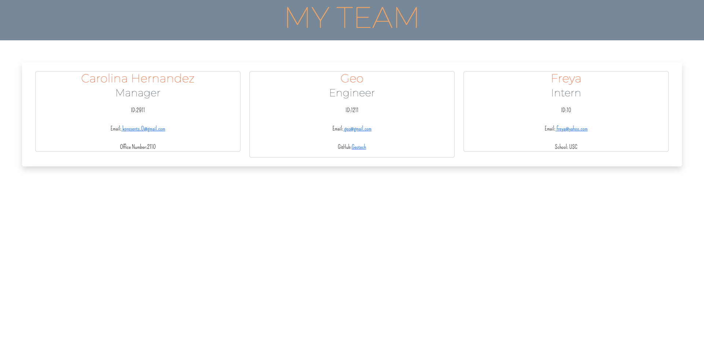

# Team Profile Generator  
  
 
  Demo Link: https://drive.google.com/file/d/1rrGReGFKid1kUjfy4YPd-Ht1Jrx8I-gS/view

  ## Description
  build a Node.js command-line application that takes in information about employees on a software engineering team, then generates an HTML webpage that displays summaries for each person. Testing is key to making code maintainable, so you’ll also write a unit test for every part of your code and ensure that it passes each test.
 
  
  ## Table of Contents
  
  - [License](#license)
  - [Installation](#installation)
  - [Contribution](#contribution)
  - [Usage](#usage)
  - [GitHub](#gitHub)
  - [Email](#email)
  
  ## License
  

  ## Installation
  Run "npm i" on your terminal to install all the dependencies. After installing run "npm test" verify the test pass, once completed then run "node index.js" and you will be prompted with questions to create your team members profiles. 
  
  ## Usage
  
  Once you finish answering all the proper questions you will then be able to see the "index.html file with all the update information and can deploy the page and reflect the update profiles. 
      
  
  ## Contribution
  n/a
  
  
  
  ## GitHub 
 GitHub Username: [kpresents] (https://github.com/kpresents)
 GitHub Repo: https://github.com/Kpresents/Team-Profile-Generator
  
  ## Email
 Email: kpresents.0@gmail.com

  
  
